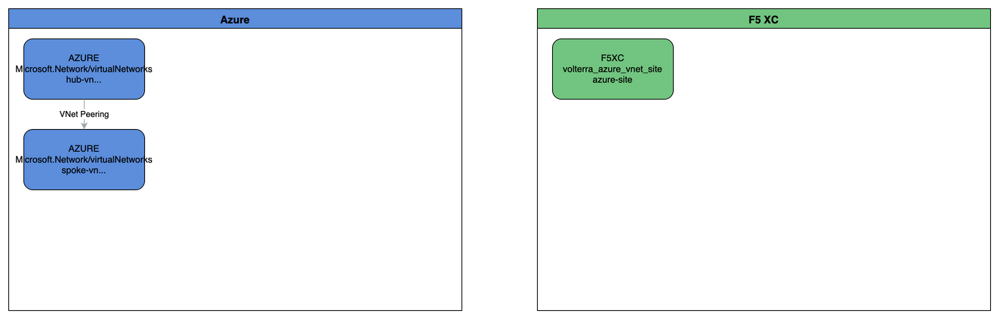

# F5 Distributed Cloud Customer Edge - Azure Deployment

Automated deployment of F5 Distributed Cloud (XC) Customer Edge nodes to Microsoft Azure using Terraform with GitHub Actions CI/CD pipeline.

## Overview

Deploy F5 XC Customer Edge instances to Azure using infrastructure-as-code with fully automated CI/CD pipeline. This solution implements hub-and-spoke network architecture with CE AppStack NVA in the hub and CE Managed Kubernetes in the spoke.

**Key Features**:
- ✅ Fully automated deployment via GitHub Actions
- ✅ Hub-and-spoke network architecture with high availability
- ✅ Secure workload identity federation (no secrets)
- ✅ Encrypted remote state management
- ✅ Automated infrastructure diagram generation

## Infrastructure Diagram

The following diagram provides a visual representation of the deployed Azure and F5 XC infrastructure, automatically generated from the current Terraform state:



**[📝 Edit Diagram](./F5_XC_CE_Infrastructure.drawio)** - Open the `.drawio` file to modify the diagram

**Diagram Components**:
- 🔵 **Azure Resources**: VNETs, subnets, load balancers, and virtual machines
- 🟢 **F5 XC Resources**: Customer Edge sites, registration details, and site configuration
- 📊 **Relationships**: Network peerings, dependencies, and connectivity flows

**Editing the Diagram**:
- **In GitHub**: Click the "Edit Diagram" link above to open the `.drawio` file in GitHub's Draw.io editor
- **Locally**: Open `F5_XC_CE_Infrastructure.drawio` with [Draw.io Desktop](https://github.com/jgraph/drawio-desktop/releases)
- **Online Editor**: Import the `.drawio` file at [diagrams.net](https://app.diagrams.net)

**Automatic Updates**: Both the PNG image and `.drawio` source file are automatically regenerated whenever infrastructure changes are applied via Terraform, ensuring they always reflect the current deployed state.

> 💡 **Note**: Both diagram files are version-controlled in Git, providing a visual history of infrastructure changes over time.

## Prerequisites

- **Azure**: Subscription with Contributor access
- **F5 XC**: Distributed Cloud account with API token
- **GitHub**: Repository with Actions enabled

## Quick Deployment

### 1. Azure Backend Setup

```bash
./scripts/setup-backend.sh
```

This creates the Azure storage account for Terraform state management.

### 2. Configure GitHub Secrets

Add these secrets in your repository settings (Settings → Secrets and variables → Actions):

| Secret | Description |
|--------|-------------|
| `AZURE_CLIENT_ID` | Azure AD application ID for workload identity |
| `AZURE_TENANT_ID` | Your Azure AD tenant ID |
| `AZURE_SUBSCRIPTION_ID` | Target Azure subscription ID |
| `F5_XC_API_TOKEN` | F5 XC Console API token |

### 3. Deploy Infrastructure

```bash
git add .
git commit -m "Deploy CE to Azure"
git push
```

GitHub Actions automatically validates and deploys your infrastructure. Monitor progress in the Actions tab.

## Manual CLI Deployment

For local development or testing without GitHub Actions, you can deploy directly using Azure CLI and Terraform:

### 1. Azure Backend Setup

```bash
./scripts/setup-backend.sh
```

The script will:
- Create Azure storage account and container for Terraform state
- Attempt to create service principal for GitHub Actions (if you have permissions)
- **Automatically generate `backend.local.hcl`** with correct values if service principal setup fails or is skipped

**Note**: If you don't have permissions to create service principals, the script will automatically fall back to manual CLI workflow and generate the backend configuration file for you.

### 2. Authenticate with Azure CLI

```bash
az login
az account set --subscription <your-subscription-id>
```

### 3. Configure Terraform Variables

```bash
cd terraform/environments/dev
cp terraform.tfvars.example terraform.tfvars
# Edit terraform.tfvars with your F5 XC and Azure configuration
export TF_VAR_f5_xc_api_token="your-xc-api-token"
```

### 4. Deploy Infrastructure

```bash
terraform init -backend-config=backend.local.hcl
terraform plan
terraform apply
```

### 5. Destroy Infrastructure (when needed)

```bash
terraform destroy
```

**Required Azure Permissions**:
- "Contributor" role (or equivalent) on resource group for deploying resources
- "Storage Blob Data Owner" role on storage account for state management

For detailed manual deployment guide, see **[Manual Deployment Guide](docs/manual-deployment.md)**.

## AI Tool Integration

This repository includes MCP (Model Context Protocol) server configuration for enhanced AI tool integration. The `.mcp.json` file defines recommended MCP servers for working with this codebase.

### Available MCP Servers

All three servers have been tested using `claude mcp add` and verified with `claude mcp list`.

#### 1. Terraform MCP Server ✅ (Tested & Working)

**Package**: `terraform-mcp-server` (version 0.13.0)
- **Type**: stdio
- **Description**: Provides access to Terraform Registry operations - browse providers, modules, and documentation
- **Install**: `npx -y terraform-mcp-server`
- **Environment variables**: None required
- **Test result**: ✓ Connected successfully

#### 2. Azure MCP Server ✅ (Tested & Working)

**Package**: `@azure/mcp` (Official Microsoft, version 0.9.6)
- **Type**: stdio
- **Description**: Provides context for Azure Storage, Cosmos DB, CLI tools, and resource management
- **Install**: `npx -y @azure/mcp server start`
- **Authentication**: Uses Azure CLI (`az login` required)
- **Prerequisites**:
  - Azure CLI installed and configured
  - Authenticated with `az login`
  - No environment variables required
- **Test result**: ✓ Connected successfully with Azure CLI authentication

#### 3. Microsoft Learn MCP Server ✅ (Tested & Working)

**URL**: `https://learn.microsoft.com/api/mcp` (Official Microsoft)
- **Type**: HTTP
- **Description**: AI assistant with real-time access to official Microsoft documentation and learning resources
- **Install**: `claude mcp add --transport http microsoft-learn https://learn.microsoft.com/api/mcp`
- **Environment variables**: None required
- **Test result**: ✓ Connected successfully

### Using with Claude Code

To enable MCP servers in Claude Code:

```bash
# Add server to global configuration
claude mcp add

# Or manually edit ~/.config/claude-code/mcp.json
# Copy server configuration from .mcp.json in this repository
```

### Local Overrides

Create `.mcp.local.json` (gitignored) for environment-specific MCP configurations:

```json
{
  "mcpServers": {
    "azure": {
      "env": {
        "AZURE_SUBSCRIPTION_ID": "your-actual-subscription-id",
        "AZURE_TENANT_ID": "your-actual-tenant-id"
      }
    }
  }
}
```

For more details, see [Claude Code MCP Documentation](https://docs.claude.com/en/docs/claude-code/mcp).

## What Gets Deployed

- **Hub VNET**: Virtual network with CE AppStack nodes as Network Virtual Appliances
- **Spoke VNET**: Virtual network with CE Managed Kubernetes
- **Load Balancer**: Internal Azure Load Balancer for NVA high availability
- **VNET Peering**: Connectivity between hub and spoke networks
- **Network Security**: NSGs and routing for secure traffic flow

## Documentation

- **[Architecture Details](docs/architecture.md)** - Technical architecture and design
- **[Developer Guide](docs/development.md)** - Development environment and workflows
- **[Requirements](docs/requirements.md)** - System specifications and prerequisites
- **[Quickstart Guide](specs/001-ce-cicd-automation/quickstart.md)** - Detailed deployment instructions

## Support

- **Issues**: [GitHub Issues](https://github.com/robinmordasiewicz/f5-xc-ce-terraform/issues)
- **F5 XC Documentation**: https://docs.cloud.f5.com
- **Azure Architecture**: https://learn.microsoft.com/azure/architecture/

## Contributing

See [Developer Guide](docs/development.md) for development environment setup and contribution guidelines.

---

🤖 **Infrastructure as Code** | ⚡ **Automated Deployment** | 🔒 **Secure by Default**
